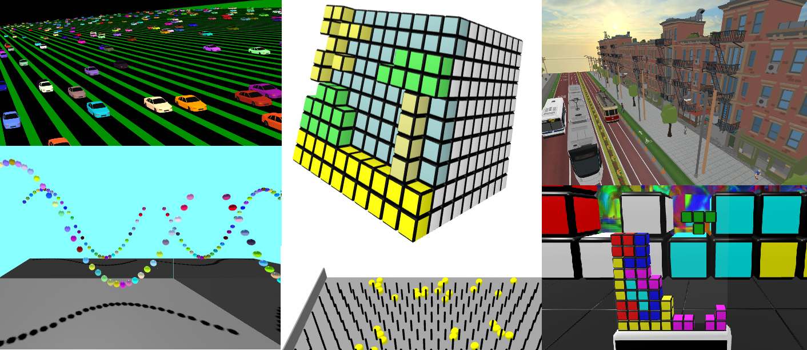

# instanced-mesh
A set of components to support use of three.js InstancedMesh object within A-Frame, which can dramatically improve rendering performance where a multiple identical geometries are being used.



The key goal of these components is to make use of instancing within A-Frame as simple as possible, and as similar as possible to working with regular non-instanced entities.

## Overview

The three.js [InstancedMesh](https://threejs.org/docs/index.html#api/en/objects/InstancedMesh) object provides a very efficient way to render multiple objects that have the same geometry, but may be in different positions, orientations or scales..  In particular, it massively reduces the number of draw calls required - which is very frequently the bottlneck in terms of rendering performance.

A-Frame does not natively provide access to InstancedMesh, and the A-Frame DOM doesn't map very naturally across to Instanced Meshes.

This component intends to provide a way for A-Frame applications to make use of Instanced Meshes, while continuing to use A-Frame entities in the same way they would normally.

## Installation

You will need the instanced-mesh javascript module from this repository.

You can download it and include it like this:

```
<script src="instanced-mesh.js"></script>
```

Or via JSDelivr CDN (check the releases in the repo for the best version number to use)

```
<script src="https://cdn.jsdelivr.net/gh/diarmidmackenzie/instanced-mesh@v0.6.0/src/instanced-mesh.min.js"></script>
```

Or available on npm as [aframe-instanced-mesh](https://www.npmjs.com/package/aframe-instanced-mesh):


## Quickstart Guide

The basic set-up is as follows:
- Create a new entity, with the component "instanced-mesh" configured on it, and the desired geometry, materials etc. that you want to  have multiple instances of.  Do *not* set any position, rotation or scale on this entity (doing so is highly likely to cause problems - see notes below!)
- For each entity that has this geometry and materials, you won't need any geometry and materials configured.  Just set position, rotation & scale as required, and configure the "instanced-mesh-member" component, with a reference to the "instanced-mesh".

Sample code:

```
    <a-box id="mesh1" color="red" instanced-mesh>
    </a-box>
    <a-entity id="block1" position="-2 0 -2" instanced-mesh-member="mesh:#mesh1">
    </a-entity>
    <a-entity id="block1" position="2 0 -2" instanced-mesh-member="mesh:#mesh1">
    </a-entity>
```

Repeat the above for each type of object that you want to have multiple instances of.

See the rest of this doc for more details, but this should be enough to get you started...

Note: if your objects are not all in the same Frame of Reference as each other (i.e. they have different parents), you'll need to take more care - read on below, specifically you probably need to set positioning to "world" on the `instanced-mesh`component.


## Examples

See [this page](	https://diarmidmackenzie.github.io/instanced-mesh/examples) for examples of usage.


## Interface

### instanced-mesh

This should be configured on an entity that describes the desired geometry and materials of the members of the Instanced Mesh.  The entity *must* be configured with an id.

For performance and simplicity, this entity should preferaly be in the same Frame of Reference as all the members of this mesh (but this is not essential - see ["notes on positioning"](#markdown-header-notes-on-positioning) below).

Configuration as follows:

| Property    | Type                                           | Explanation                                                  | Default  |
| ----------- | ---------------------------------------------- | ------------------------------------------------------------ | -------- |
| capacity    | number                                         | The number of members that can be in this mesh.  Excess capacity has a modest overhead in memory usage, and no impact on rendering costs.    If you exceed this capacity, you'll get a console warning, and the last requested object will simply not be rendered. | 100      |
| fcradius    | number                                         | The radius for the bounding Sphere used for Frustrum Culling.  Default is 0, which means no frustrum culling occurs.  When specified with a positive value, frustrum culling is enabled on the mesh using a bounding sphere with this radius, and center fccenter (next property).  If set zero or negative, there is no frustrum culling, and the whole mesh is rendered the whole time, even when off camera.  Note that frustrum culling is all-or-nothing, applied to the whole mesh.  Frustrum culling of individual members is not possible. | 0        |
| fccenter    | vec3                                           | The center for the bounding Sphere used for Frustrum Culling.  This is only meaningful if fcradius is specified with a value greater than 0.  The format is 3 co-ordinates, separated with spaces (like a position), representing the X, Y and Z co-ordinates.  These co-ordinates are interpreted in the local position space of the entity the instanced-mesh is applied on (which may be different from world space). | none     |
| positioning | "local" or "world"                             | The positioning mode used for members in the mesh, one of:<br /> - **local**: the member objects and the instanced mesh are assumed to be in the same position in the scene graph, and hence in the same frame of reference for position, scale & orientation.  The transform matrix for each member object is used naively to set the transform matrix for the instance in the instanced mesh. <br /><br />- **world**: the member objects and the instanced mesh may be in different positions in the scene graph.  The transform matrix for each member object is transformed into the frame of reference of the instanced mesh.  Note that if these frames of reference change positions relative to each other, the positions of the mesh members will only be updated in "auto" mode, or via the object3DUpdated event. | "local"  |
| layers      | String of comma-separated numbers, e.g. "0, 1" | A string listing the layers in which the Instanced Mesh should be rendered (affects the entire mesh).  A string like "0, 1" to render in layers 0 & 1.  Default is "", which leaves the default behaviour in place (equivalent to setting layers:"0", except that the latter would explicitly set them to 0, rather them leaving them unchanged).  For more on THREE.js layers see https://threejs.org/docs/index.html#api/en/core/Layers and https://github.com/bryik/aframe-layers-component<br /> Note that bryik's Layers component doesn't work with Instanced Meshes, which is why layers support has been added directly to this component. | none     |
| debug       | boolean                                        | Enables some debug console logs.  If you have a large number of dynamic objects, this will hurt performance.<br />For debug logs to be useful, it is recommended to configure IDs on the instance mesh member entities, as well as the mesh entity itself. | false    |
| updateMode  | "manual" or "auto"                             | How to handle updates to the positions of instanced members.<br />- **manual**: transforms of members of the instanced mesh are only updated when the object3DUpdated event is emitted on that instanced mesh member.<br />- **auto**: transforms of all members of the instanced mesh are automatically updated every frame.<br />When the mesh members are static, or mostly static, manual updates generally perform better and are recommended.  If you expect many member transforms to update most frames (e.g. a collection of dynamic physics bodies), automatic updates are likely to perform better. | "manual" |
| decompose   | boolean                                        | When this is set, a geometry that contains multiple [groups](https://threejs.org/docs/?q=in#api/en/core/BufferGeometry.groups) will be decomposed into multiple Instanced Meshes.  The main reason you'd want to do this is to apply different colors to each group for different members of the mesh (see the `colors` property on `instanced-mesh-member`).  Usually if you set this, you'll also want to set `drainColor: true`, see below. | false    |
| drainColor  | boolean                                        | When this is set, the color on the instanced mesh's material is set to white, and color is set explicitly for each member.  Colors are set using the `colors` property on `instanced-mesh-member`, but where there is no color specified on a member, the default color is re-instated.<br />Note that if colors are drained on an instanced mesh that supports multiple materials (via groups configured on the geometry), then it should be decomposed using `decompose: true` , see above.  If the mesh is not decomposed, then it is not possible to re-instate colors at the member level.  In such a configuration, a console warning is generated, and the mesh is rendered in a grey color. | false    |

#### Notes on positioning

`instanced-mesh` supports two positioning modes, "local" and "world" as described above.

Local positioning does not require any matrix transformations, and will typically perform better.  However, it can only be used when the instanced mesh and the members are at the same position in the scene graph (i.e. in the same frame of reference for position, orientation and scale).  If this is not the case, instanced mesh members position, orientation and scale will not match those of the member objects.

World positioning will allow for instanced meshes to include members where the member objects are in different positions in the scene graph.  However, when operating in manual update mode (the default) subsequent changes to positions of objects may lead to unexpected results:

- If the instanced mesh, or a parent of it, is moved, then the members of the mesh will all be moved, even if the objects representing the members have not actually moved.
- if a member object is moved (either directly, or as a result of the movement of a parent in the scene graph), is moved, the position of the instanced mesh member will only be updated when the object3DUpdated event is generated.  Where a parent is moved, it will be necessary to trigger this event on every child member object that has moved.

If these restrictions are causing you problems, the best solution is probably to change the instanced mesh to "auto" update mode, where transforms of individual mesh members are updated every frame.

### instanced-mesh-member

This should be configured on an entity that describes the desired position, orientation and scale of a single member of the Instanced Mesh.

Configuration as follows:

| Property   | Type     | Explanation                                                  | Default |
| ---------- | -------- | ------------------------------------------------------------ | ------- |
| mesh       | selector | A selector for the mesh that this entity is to be a member of. |         |
| debug      | boolean  | enables some debug console logs.  If you have a large number of dynamic objects, this will hurt performance.<br />For debug logs to be useful, it is recommended to configure IDs on the instance mesh member entities, as well as the mesh entity itself. | false   |
| memberMesh | boolean  | creates an invisible mesh for each member.  This can be useful for raycasting or physics body shape configuration on instanced Mesh members. | false   |
| colors     | array    | an array of colors to use in coloring this member of the instanced mesh.  Provide a comma-separated list of colors, e.g. `black, yellow` or `#000, #ff0`.  Where colors are not specified, the default coloring of the original instanced mesh is used.<br />When coloring individual instanced mesh members, `drainColor` should be set on the instanced mesh, so that the original mesh colors do not interfere with the new colors.  Also, for multi-material meshes, `decompose` should be set on the instanced mesh, to allow each color to be specified independently.<br />For multi-material geometries, the order of the colors corresponds to the `materialIndex` values of the [groups](https://threejs.org/docs/?q=mesh#api/en/core/BufferGeometry.groups) in the geometry.  For multi-part GLTF meshes, the order of the colors corresponds to the order of parts in the GLTF. |         |


In "manual" update mode, a custom event, "object3DUpdated" *must* be emitted on this entity whenever the entity's object3D configuration is updated, to ensure that changes are synchronized to the mesh - see next section.

### object3DUpdated Event

When operating in "manual" update mode, the object3DUpdated event is very important.  It is not required when running in "auto" update mode.

This event must be emitted on any entity that uses the instanced-mesh-member component, whenever that entity's object3D settings are updated.

Specifically, this must be done:

- whenever the object's position, rotation or scale are modified.
- whenever the object's visibility state changes (visible = true/false)
- whenever the object's color changes.

If this event is not emitted, the Instanced Mesh won't be updated with the change, and the rendered object will no become out of sync with what is set on the object.

The reason this event is used, rather than e.g. scanning all objects for any such updates, is for performance reasons.

This should be a minimal addition to application code.  After completing any set of changes to the object3D, whether done directly, or via setAttribute, e.g.

```
el.object3D.position.x += 0.1
```

just add this line...

```
el.emit("object3DUpdated")
```

### Using Mixins

If existing object code uses mixins to set geometry and materials, it should be very straightforward to move an an Instanced Mesh rendering model.

Previously, you might have a mixin like this.

```
<a-mixin id="red-box"
         geometry="primitive: box;"
         material="color:red"
         scale="0.1 0.1 0.1">
 </a-mixin>
```

This can simply be replaced by the following - and the entities that make use of the mixin won't need to be modified at all (*)

     <a-entity id="mesh-red-box"
               geometry="primitive: box;"
               material="color:red"
               instanced-mesh>
    </a-entity>
    <a-mixin id="red-box"
             instanced-mesh-member="mesh:#mesh-red-box"
             scale="0.1 0.1 0.1">
    </a-mixin>
(*) One modification that may be needed:

- If using "manual" update mode (the default), any code that modifies object3D properties must be updated to emit the object3DUpdated event, as per above.


## Multi-mesh GLTF models

Some GLTF models consist of multiple meshes, each of which can have their own transform.

To support instanced meshes for these models, we create a separate Instanced Mesh for each of these child meshes, and keep them all up to date.

See examples:

[3D Models Multi-mesh](https://diarmidmackenzie.github.io/instanced-mesh/tests/3d-models-multi-mesh.html)

[Movement Multi-mesh](https://diarmidmackenzie.github.io/instanced-mesh/tests/movement-multi-mesh.html)

[Add & Remove Multi-mesh](https://diarmidmackenzie.github.io/instanced-mesh/tests/add-remove-multi-mesh.html)

[Updates Multi-mesh](https://diarmidmackenzie.github.io/instanced-mesh/tests/updates-multi-mesh.html)

Some known issues:

- Applying transforms to the instanced-mesh entity itself won't give the results you'd expect.  Apply any transforms that are required to the instances (either directly, or via mixin).

## Supported Features

#### Supported Features - Tested

The following features have been explicitly tested, and are expected to work:

On the mesh:

- Various geometries
- Various materials
- Shadows

On the member entity:

- Movement (i.e. change of position)
- Rotation (i.e. change of orientation) - can be set via rotation or quaternion settings
- Change of scale
- Change of visibility: visible = true / false.
- Creation & deletion.

#### Should work - not yet tested

The following features ought to work, but have not yet been tested.

On the mesh:

- Transparency & Opacity.


## Physics & Raycasting

To support physics and raycasting on instanced meshes, we provide the option to retain an invisible mesh for some or all mesh members, using the `memberMesh` option on the `instanced-mesh-member` component.

When this option is enabled on a mesh member, an invisible mesh is configured on the member, corresponding to its appearance as rendered in the instanced mesh.

This is not used for rendering, and so has no impact on draw calls or rendering costs, which remain highly efficient.

Typical uses for this are:

- For raycasting.  Since raycasting works against invisible objects, when `memberMesh` is configured on an instanced mesh member, it can be raycasted against just like any other element.
- For physics body configuration.  Physics engines like [aframe-physics-system](https://github.com/c-frame/aframe-physics-system) and [physx](https://github.com/c-frame/physx) typically derive physics body shapes automatically from an entity's mesh.  When using instancing, this same functionality can be made available by configuring `memberMesh` on an instanced mesh member.
  - Note: this function is not yet working for PhysX, and has some caveats for Cannon.  See [issue #15](https://github.com/diarmidmackenzie/instanced-mesh/issues/15) for details.

It's worth noting that using `memberMesh` is just one option here.  You could also manually create a simplified invisible child mesh for raycasting (as in [this example](https://diarmidmackenzie.github.io/instanced-mesh/examples/coloring-blocks/index.html)), or manually specify the physics shape to use (as done for the balls in [this example](https://diarmidmackenzie.github.io/instanced-mesh/tests/physics-ammo.html))

[THREE.js InstancedMesh](https://threejs.org/docs/#api/en/objects/InstancedMesh) does support raycasting directly against the instanced mesh.  That functionality is not used by this implementation for several reasons:

- It doesn't offer any significant performance benefit, since raycasting still has to check against every triangle in every member of the instance mesh.

- It reduces flexibility: raycasting can be enabled/disabled only at the scope of the whole mesh, rather than being enabled/disabled on a per-member basis.

- It would require updates to core A-Frame, as the additional properties reported by THREE.js instanced raycasting are not currently made available by the A-Frame raycaster & cursor components.


## Templating

`instanced-mesh`  can be used together with templating as a way to lay out the instanced mesh members within HTML.

[This example](https://diarmidmackenzie.github.io/instanced-mesh/examples/templating/) shows one of the examples re-worked to use templates in this way.

It seems to run at a slightly lower frame-rate than the [equivalent example without templating](https://diarmidmackenzie.github.io/instanced-mesh/examples/coloring-blocks/), particularly when rotating the cube of blocks, and I don't yet fully understand why.  Once the templatign has laid out the HTML, it shouldn't have any further involvement.

The templating introduces an additional `<a-entity>` layer between the scene and the elements, and that will result in additional matrix computations, and might account for some of the difference in performance.  It's not clear that this can account for all of the difference though.


## Design Considerations

#### When should you use an Instanced Mesh?

Instanced Meshes work best for large collections of static objects, with the same geometry and materials, but different positions, orientations and/or scales.  This is where you will see the most substantial benefits.

Instanced Meshes can also be used for objects that:

- are moving, rotating or changing in scale
- have dynamic lifecycles (creation & deletion)

For infrequent changes, "manual" update mode with object3DUpdated events will give the best performance.  For frequent changes across a large population of mesh members, "auto" update mode will perform better.

An Instanced Mesh requires the same number of draw calls for the entire set of instances, that would be required for a single object.  Therefore even if you only have 2 instances of an object, an Instanced Mesh could reduce the number of draw calls required.  However you'll get the greatest impact if you prioritize the objects with the most instances first.

For objects that are dynamic (either in terms of movement/rotation/scale, or creation/deletion), Instanced Mesh gives the same benefits in terms of rendering.  There is also an additional cost in keeping the Instanced Mesh in sync with the A-Frame entities,but in most cases this is substantially outweighed by the rendering savings (even if every object moves on every frame).

Creation, and especially deletion are a bit more expensive, but it's unless the lifecycle is extremely fast, it's likely that you'll see some gains from Instanced Mesh.  Hopefully it's straightforward to try it out, see what the gains are like, and remove it if it's not making enough of a difference.

#### How many should you use?

Ideally, you'd use a single Instanced Mesh for all instances of a particular object.  However there are a few reasons why you might want to split your objects between multiple Instanced Meshes, or not include some entities in the Instanced Mesh at all...

1. Separation of objects / avoidance of complexity.  When entities are rendered via an Instanced Mesh, rather than direct A-Frame rendering, this adds a level of complexity.  If objects aren't behaving as expected, it makes debugging and diagnosis of problems more complex, and increases the risk of interactions between otherwise separated parts of your scene.  This is particularly true if everything is piled into a small number of communal Instanced Meshes.  This may be best for performance, but it may become much harder to figure out what is going on, when things don't act as you expect.

4. If you wish to use Frustrum Culling, it can only be applied to an entire Instanced Mesh.  Therefore if you have clusters of the same object, in multiple different areas, it may make sense to use different Instanced Meshes, so that one cluster can be frustrum culled, without affecting the other.


## Limitations

The following are known limitations.  Some of these are easy to lift.  Others less so...

- Changing the mesh that an entity belongs to without re-creating the entity -- This is not yet implemented - but not too complex.  Just requires instanced-member-mesh to remove the member from one mesh and add it to the other.
- Frustrum Culling is supported, but there are no automatic calculations.  To use frustrum culling, the user of this component must explicitly specify the center and radius for a bounding sphere that contains all members of the Instanced Mesh.
- Update processing to change the properties of the instanced mesh basically works, but I am concerned we may have a small leak when we increase capacity, as I've not been able to cleanly dispose of the old Instances Meshes.
- Others...?  There's bound to be a bunch of relevant stuff that I don't know about.  If it's not been explicitly mentioned as supported / tested, then it probably doesn't work!  Feel free to try things out.  If things work, please add tests to /tests/ and notes to this README!


## Acknowledgements

This component was a big help in getting started with three.js InstancedMesh in A-Frame.

https://github.com/EX3D/aframe-InstancedMesh

And [@kfarr](https://stackoverflow.com/users/5347747/kieran-f) helped me to discover that repo, thanks to [this](https://stackoverflow.com/questions/66178788/how-can-i-merge-geometries-in-a-frame-without-losing-material-information) Stack Overflow answer.


I'm indebted to @bryik's A-Frame Layers component for ideas on how to handle layers configuration:
https://github.com/bryik/aframe-layers-component

The [snowball example](https://diarmidmackenzie.github.io/instanced-mesh/tests/pbr-example.html) uses these CC0-licensed textures from Katsukagi:
https://3dtextures.me/2018/02/27/snow-002/

The texture used in the [env-map spheres example](https://diarmidmackenzie.github.io/instanced-mesh/tests/env-map-example.html) is my own (from https://github.com/diarmidmackenzie/christmas-scene)


The texture used on the [textured cubes example](https://diarmidmackenzie.github.io/instanced-mesh/tests/texture-example.html) re-uses a texture from this A-Frame example: https://aframe.io/examples/showcase/responsiveui/

The car used in the [Movement of GLTF models at high scale](https://diarmidmackenzie.github.io/instanced-mesh/tests/3d-models-scale-movement.html) example is from [Tomás Laulhé](https://quaternius.com/packs/cars.html)
