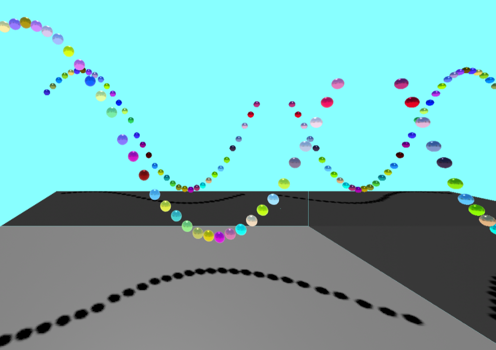
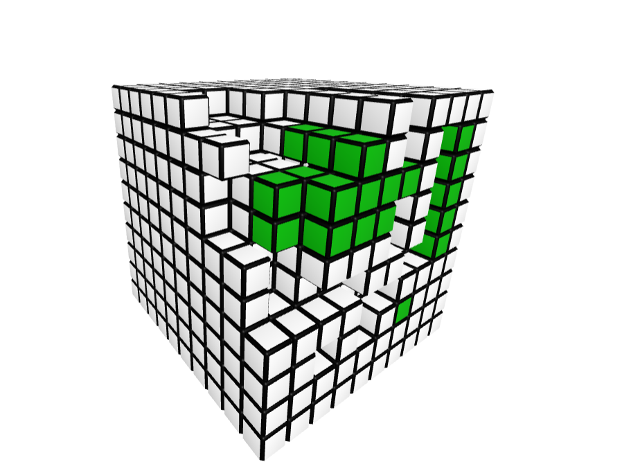

# Examples

Here are some examples of what can be done using A-Frame Instanced Mesh...

1000 x 12-part GLTF models in a single scene, rendered with just 14 draw calls - [View Example](https://diarmidmackenzie.github.io/instanced-mesh/examples/gltf-models/index.html)

An example showing Instanced Mesh in combination with A-Frame animation component, shadows, an environment map, and mirrors - [View Example](https://diarmidmackenzie.github.io/instanced-mesh/examples/animated-spheres/index.html)

Example showing raycasting, member coloring & member deletion - [View Example](https://diarmidmackenzie.github.io/instanced-mesh/examples/coloring-blocks/index.html)

For examples of Instanced Mesh in production, see our [Showcase](https://diarmidmackenzie.github.io/instanced-mesh/showcase/)

# Tests of individual features

A wide range of examples have been developed to test individual features.  To some extent these are in place of Unit Tests (which we don't have yet, but will hopefully add at some point).

They may also be useful as examples to show how to use the various options.

#### Basic examples...

[Basic Example (Blocks)](https://diarmidmackenzie.github.io/instanced-mesh/tests/basic-test.html)

[Basic Example (Spheres)](https://diarmidmackenzie.github.io/instanced-mesh/tests/spheres.html)

[Basic Example (different colored blocks - one mesh per color)](https://diarmidmackenzie.github.io/instanced-mesh/tests/multi-color.html)

[3D Models](https://diarmidmackenzie.github.io/instanced-mesh/tests/3d-models.htm)

#### Specific capabilities of the component...

[Adding and Removing Objects](https://diarmidmackenzie.github.io/instanced-mesh/tests/add-remove.html)

[Movement](https://diarmidmackenzie.github.io/instanced-mesh/tests/movement.html)

[Frustrum Culling](https://diarmidmackenzie.github.io/instanced-mesh/tests/frustrum-culling.html)

[Multiple Layers](https://diarmidmackenzie.github.io/instanced-mesh/tests/multi-layer.html)

[Non-visible elements](https://diarmidmackenzie.github.io/instanced-mesh/tests/non-visible.html)

[Positioning (handling diverse frames of reference)](https://diarmidmackenzie.github.io/instanced-mesh/tests/positioning.html)

[Positioning, with "auto" update mode](https://diarmidmackenzie.github.io/instanced-mesh/tests/positioning-auto.html)

[Different Scale Attributes](https://diarmidmackenzie.github.io/instanced-mesh/tests/scale-attribute.html)

#### Scaling capabilities of instanced meshes...

[Adding and Removing Objects at High Scale](https://diarmidmackenzie.github.io/instanced-mesh/tests/add-remove-high-scale.html)

[Rotation at High Scale](https://diarmidmackenzie.github.io/instanced-mesh/tests/rotation-high-scale.html)

[Rotation at High Scale, with "auto" update mode](https://diarmidmackenzie.github.io/instanced-mesh/tests/rotation-high-scale-auto.html)

[Capacity Updates](https://diarmidmackenzie.github.io/instanced-mesh/tests/updates.html)

#### Examples with Multi-mesh GLTF models

[3D Models Multi-mesh](https://diarmidmackenzie.github.io/instanced-mesh/tests/3d-models-multi-mesh.html)

[Movement Multi-mesh](https://diarmidmackenzie.github.io/instanced-mesh/tests/movement-multi-mesh.html)

[Add & Remove Multi-mesh](https://diarmidmackenzie.github.io/instanced-mesh/tests/add-remove-multi-mesh.html)

[Capacity Updates Multi-mesh](https://diarmidmackenzie.github.io/instanced-mesh/tests/updates-multi-mesh.html)

#### Examples with Textures and other shader maps

[Flat textures](https://diarmidmackenzie.github.io/instanced-mesh/tests/texture-example.html)

[PBR (normal, displacement, ambient occlusion)](https://diarmidmackenzie.github.io/instanced-mesh/tests/pbr-example.html)

[Env-Map](https://diarmidmackenzie.github.io/instanced-mesh/tests/env-map-example.html)

#### Raycasting & Physics

[Raycasting](https://diarmidmackenzie.github.io/instanced-mesh/tests/raycasting.html)

[Physics w/ Ammo Driver](https://diarmidmackenzie.github.io/instanced-mesh/tests/physics-ammo.html)

[Physics w/ Cannon Driver](https://diarmidmackenzie.github.io/instanced-mesh/tests/physics-cannon.html)

### Per-member coloring

[Multi-color spheres](https://diarmidmackenzie.github.io/instanced-mesh/tests/spheres-multi-color.html)

[Different colored blocks in a single Instanced Mesh](https://diarmidmackenzie.github.io/instanced-mesh/tests/multi-color-single-mesh.html)

[Multi-color PBR](https://diarmidmackenzie.github.io/instanced-mesh/tests/pbr-multi-color.html)

