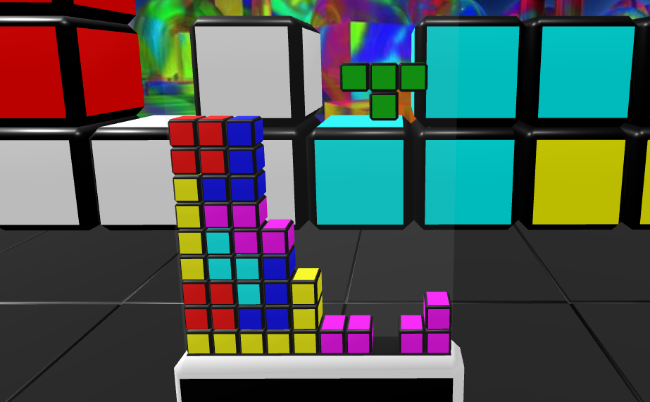
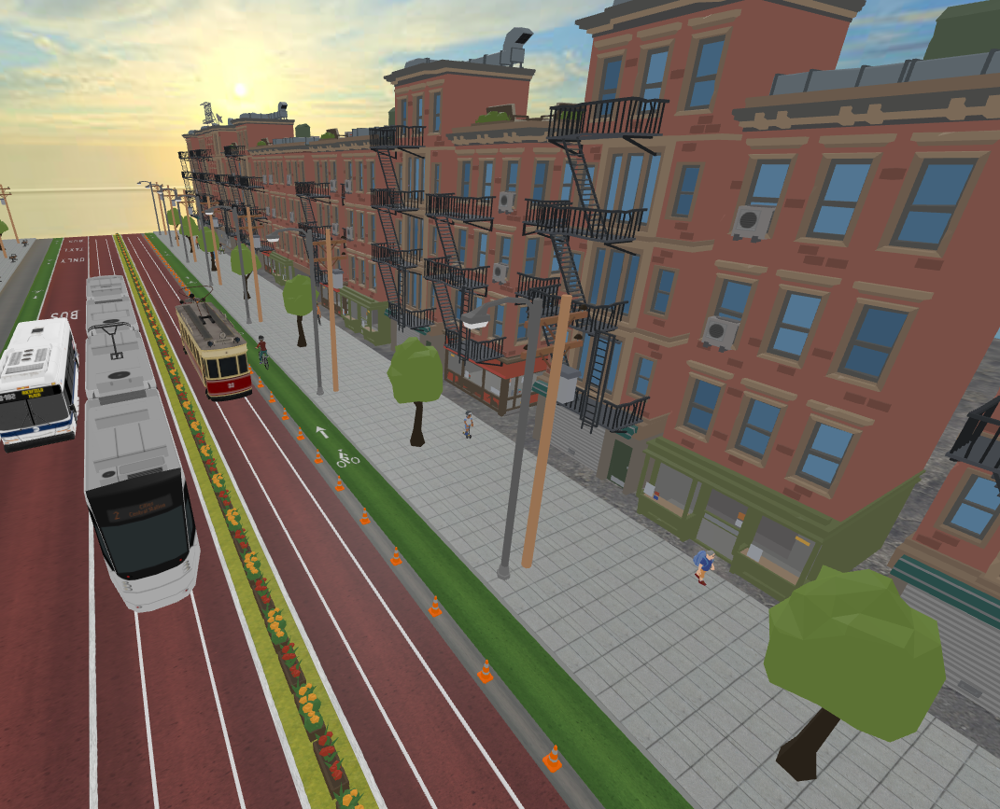

This page showcases live games, experiences and other products that use A-Frame Instanced Mesh.

### Blocks Arcade

Blacks Arcade is a VR-focused arcade full of 2D & 3D falling blocks games.  I built it as a part of my learning journey with A-Frame and 3D Web, and it provided my original motivation for building an Instancing component for A-Frame.

### 3D Street by Kieran Farr

[3D Street](https://www.3dstreet.org/) is a tool used for desktop & VR visualization of street scenes.

### Coming Soon...

Various other people are building A-Frame experiences using A-Frame Instanced Mesh.  I look forward to being able to include those projects on this page when they become public.

If you've built something using A-Frame Instanced Mesh and would like it included here, please raise an issue or submit a PR to add it to this page.

